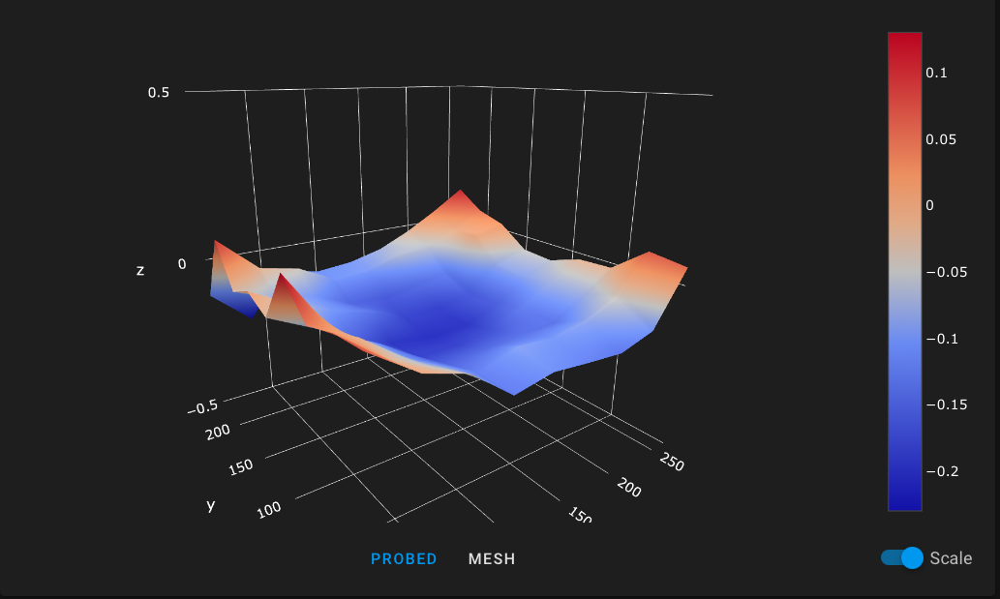
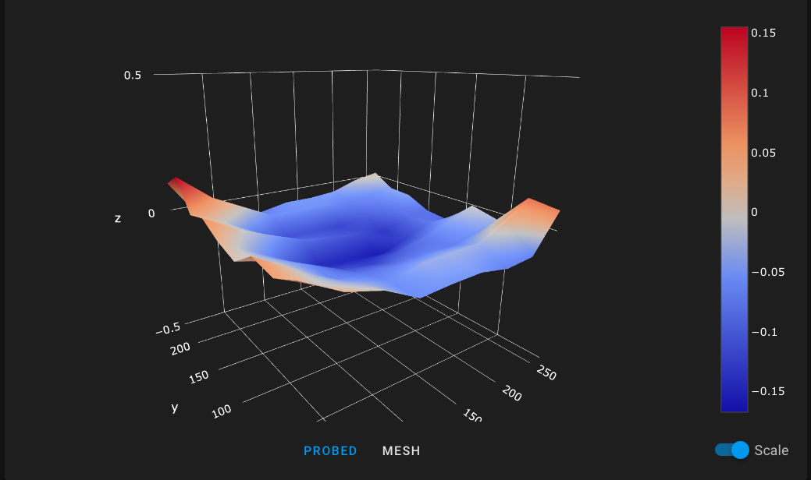

# Firmware

I dont want to recompile + reupload to test every change I want to make, therefore I chose to use Klipper for my firmware.

Klipper has very active development, a ton of cool features that are missing in Marlin and is in general a lot more easy/quick to work with.


Price: Depends on the version of Raspberry Pi you get

Price/Performance: 5/5

Price/Niceness factor: 5/5

# Noise

Put in a new motherboard with silent steppers, a couple of 120mm fans for the electronics cooling, a 4020 silent fan on the hotend and a better 5015 fan for the parts cooling and you will have a really quiet machine.


Price: Around 80 EUR

Price/Performance: 0/5

Price/Niceness factor: 5/5


I first ofted for a fancy 4020 24v Sunon fan(MF40202V21000UA99) for the hotend cooling, but it was a bit noise so I decided to try a 4020 12v Noctua(NF-A4x20 FLX) that drastically reduced the noise and I have yet to experience any heat creap and clogged hotends. For parts cooling I opted for a Sunon MF50151V1-A99.

For the 120mm fans I just bought a 3 pack of silent fans for 15 eur and they are plenty silent and provide much better cooling than the stock fan for the electronics case. 
 
I used [this](https://www.thingiverse.com/thing:4097206) case lid to make room for the 120mm fans and [this](https://www.thingiverse.com/thing:4013256) hotend adapter to make room for the bigger fans.

# Frame stability

## TLDR

TODO

## Proceess
Ive placed my phone like this


And ran three tests(x movements, y movement, cross movements, these files are in the gcode folder. tldr they cause a lot of vibrations) and meassured the vibrations with a [vibration analysis app](https://apps.apple.com/us/app/vibration-analysis/id817385888)

Then I mounted the following parts


And ran the same tests again

## X gcode


## Y gcode


## Cross


# Bed

## TLDR

```
1. Princore plate range: TODO
2. Sovol plate and Sovol glass flat side up range: 0.25 mm
4. Sovol plate and Sovol glass bumpy side up range: 0.34 mm
5. Sovol plate and spring steel range: 0.36 mm
```

* If you dont want anything fancy the stock glass bed is plenty good. 
* If you want a magnetic spring steel surface, you need a better(machined) build plate.
* If you need to print with high bed temperatures, you need a better(machined) build plate.

Price: 115 eur
Price/Performance: 0/5 (If you do not need heated bed and/or spring steel)
Price/Performance: 5/5 (If you need heated bed and/or spring steel)
Price/Niceness factor: 3/5

## Hot vs cold bed

When heating up the build plate it will warp. Compare these two measurments with stock build plate + magnetic base kit at room temperature(20c) and allowing the heated bed sit at 65 degrees for 10 mins before taking the second test.





This does not happen with the milled build plate from Princore.

## Proceess
Between every test case the following was done

1. Level all bed screws with [SCREWS_TILT_CALCULATE](https://www.klipper3d.org/Config_Reference.html#screws_tilt_adjust) until there was at maximum 0.01 mm difference between the highest and lowest point above the leveling screws.

2. Run a 9x9 [BED_MESH_CALIBRATE](https://github.com/KevinOConnor/klipper/blob/master/docs/Bed_Mesh.md) without any fancy interpolation between the points. All tests with the bed at room temperature.

```
[bed_mesh]
speed: 150
horizontal_move_z: 5
mesh_min: 5,5
mesh_max: 275,240
algorithm: bicubic
mesh_pps: 0
```

## Tests
### Stock Sovol glass bed

#### Flat side up
```
min: -0.185000 mm
max: 0.062500 mm
range: 0.25 mm
```


#### Textured side up
```
min: -0.272500
max: 0.072500
range: 0.34 mm
```


### Princore milled build plate

https://princore.de/products/sovol-sv01-flexplate-druckbett-druckplatte-set-magnetsystem-federstahl-blech?_pos=3&_sid=228fae5d1&_ss=r

### Sovol magnetic build surface

https://sovol3d.com/products/280-240mm-tempered-glass-plate-3d-printer-platform-heated-bed-build-surface-glass-plate?variant=33538488631384

```
min: -0.230000 mm
max: 0.130000 mm
range: 0.36 mm
```


# Hotend

TODO
